# Système d'Animation - Front App

## 🎨 Vue d'ensemble

Le système d'animation combine **CSS Transitions** et **Intersection Observer API** pour créer des animations fluides et performantes. Il s'inspire du système ArtTherapy tout en étant adapté à l'architecture Alpine.js.

## 📁 Structure

```
resources/
├── js/front/components/animations.js    # Logique JavaScript
├── css/front/front.css                  # Styles CSS spécifiques au front
├── css/shared/shared-utilities.css      # Utilitaires CSS partagés
└── views/                              # Templates utilisant les animations
```

## 🏗️ Architecture du système

### 1. **Principe de fonctionnement**

Le système utilise un **pattern CSS + JavaScript** :

1. **CSS** définit les états d'animation (initial → final)
2. **JavaScript** détecte la visibilité et ajoute les classes
3. **Intersection Observer** optimise les performances

```mermaid
graph TD
    A[Élément avec .fade-in-up] --> B[Intersection Observer détecte]
    B --> C{Élément visible ?}
    C -->|Oui| D[Ajoute classe .visible]
    C -->|Non| E[Continue à observer]
    D --> F[CSS transition s'active]
    F --> G[Animation visible]
```



### 2. **Classes CSS d'animation**

Le système utilise des classes CSS avec états :

```css
/* État initial (invisible) */
.fade-in-up {
    opacity: 0;
    transform: translateY(30px);
    transition: opacity 0.6s ease-out, transform 0.6s ease-out;
}

/* État final (visible) */
.fade-in-up.visible {
    opacity: 1;
    transform: translateY(0);
}
```

## 🎯 Classes d'animation disponibles

### **Animations d'apparition**

| Classe | Effet | Utilisation |
|--------|--------|-------------|
| `.fade-in-up` | Apparition depuis le bas | Textes, cartes |
| `.fade-in-left` | Apparition depuis la gauche | Images, sidebars |
| `.fade-in-right` | Apparition depuis la droite | Call-to-actions |

### **Classes de base disponibles**

| Classe | Effet | Utilisation |
|--------|--------|-------------|
| `.btn-base` | Base pour les boutons avec effets | Boutons avec scale et shadow |
| `.prose-brush` | Effet pinceau sur texte gras | Titres avec effet artistique |

**Note**: Les animations flottantes et effets de survol avancés ne sont pas encore implémentés dans le CSS actuel.

## 💻 Utilisation dans le HTML

### **1. Animations automatiques**

```html
<!-- Animation de base -->
<div class="fade-in-up">
    <h2>Titre qui apparaît</h2>
    <p>Contenu qui suit</p>
</div>

<!-- Animation avec délai -->
<div class="fade-in-left" data-animation-delay="200">
    
</div>

<!-- Animation depuis la droite -->
<div class="fade-in-right" data-animation-delay="400">
    <button class="btn-primary">Action</button>
</div>
```

### **2. Boutons avec effets**

```html
<!-- Bouton avec classes de base -->
<button class="btn-base bg-blue-500 text-white">
    Action principale
</button>

<!-- Bouton avec effet personnalisé -->
<button class="btn-base bg-green-500 text-white hover:bg-green-600">
    Action secondaire
</button>
```

### **3. Effets artistiques**

```html
<!-- Texte avec effet pinceau (dans prose) -->
<div class="prose prose-brush">
    <h1>Titre avec <strong>effet pinceau</strong></h1>
    <p>Texte normal avec des mots <strong>en surbrillance</strong>.</p>
</div>

<!-- Image avec masque (si SVG disponible) -->

```

## 🎛️ API JavaScript

### **1. Méthodes disponibles via frontApp()**

```javascript
// Dans un composant Alpine
<div x-data="frontApp()">
    <!-- Déclencher animation manuelle -->
    <button @click="triggerAnimation('.my-cards', 'fade-in-up', 100)">
        Animer les cartes
    </button>
    
    <!-- Animation en cascade -->
    <button @click="triggerAnimation('.list-item', 'fade-in-left', 0)">
        Animer la liste
    </button>
</div>
```

### **2. Observer personnalisé**

```javascript
// Créer un observer pour des besoins spécifiques
const elements = document.querySelectorAll('.special-animation');
const observerId = this.addCustomObserver(
    elements,
    (entries) => {
        entries.forEach(entry => {
            if (entry.isIntersecting) {
                entry.target.classList.add('custom-visible');
                // Logique personnalisée
            }
        });
    },
    {
        threshold: 0.5,
        rootMargin: '0px 0px -100px 0px'
    }
);
```

### **3. Contrôle programmatique**

```javascript
// Accès direct au système d'animation
if (window.frontAppAnimations) {
    // Déclencher une animation spécifique
    window.frontAppAnimations.triggerAnimation('.elements', 'fade-in-right', 300);
    
    // Nettoyer les observers
    window.frontAppAnimations.destroy();
}
```

## ⚡ Optimisations et performances

### **1. Intersection Observer**

```javascript
// Configuration optimisée
const observerOptions = {
    threshold: 0.1,                    // Déclenche à 10% de visibilité
    rootMargin: '0px 0px -50px 0px'   // Déclenche 50px avant d'être visible
};
```

**Avantages :**

- ✅ **Performance native** : Pas de calculs manuels de position
- ✅ **Threading optimisé** : Calculs dans un thread séparé
- ✅ **Automatic cleanup** : Observer se désactive après animation

### **2. Animation en cascade**

Le système détecte automatiquement les groupes d'éléments et les anime en cascade :

```javascript
// Détection automatique de groupes
animateGroup(triggerElement) {
    const parent = triggerElement.closest('.grid, .flex, .space-y-8');
    const siblings = parent.querySelectorAll('.fade-in-up, .fade-in-left, .fade-in-right');
    
    siblings.forEach((sibling, index) => {
        setTimeout(() => {
            sibling.classList.add('visible');
        }, index * 150); // Délai en cascade
    });
}
```

### **3. Optimisation du parallax**

```javascript
// Throttling pour les animations de parallax
const handleParallax = window.utils.throttle(() => {
    parallaxElements.forEach(element => {
        const speed = parseFloat(element.dataset.parallax) || 0.5;
        const yPos = -(window.pageYOffset * speed);
        element.style.transform = `translateY(${yPos}px)`;
    });
}, 16); // ~60fps
```

## 🎨 Personnalisation des animations

### **1. Créer de nouvelles animations CSS**

```css
/* Animation personnalisée */
.fade-in-scale {
    opacity: 0;
    transform: scale(0.8);
    transition: opacity 0.6s ease-out, transform 0.6s ease-out;
}

.fade-in-scale.visible {
    opacity: 1;
    transform: scale(1);
}

/* Animation de rotation */
.rotate-in {
    opacity: 0;
    transform: rotate(-45deg);
    transition: opacity 0.8s ease-out, transform 0.8s ease-out;
}

.rotate-in.visible {
    opacity: 1;
    transform: rotate(0deg);
}
```

### **2. Étendre le système JavaScript**

```javascript
// Dans animations.js, ajouter de nouvelles animations
setupCustomAnimations() {
    const customElements = document.querySelectorAll('.fade-in-scale, .rotate-in');
    customElements.forEach(el => {
        this.mainObserver.observe(el);
    });
}
```

### **3. Animations conditionnelles**

```html
<!-- Animation selon les préférences utilisateur -->
<div :class="{ 'fade-in-up': !reducedMotion, 'no-animation': reducedMotion }">
    Contenu adaptatif
</div>

<script>
// Respect des préférences d'accessibilité
const reducedMotion = window.matchMedia('(prefers-reduced-motion: reduce)').matches;
</script>
```

## 🌐 Intégration avec Alpine.js

### **1. État réactif des animations**

```html
<div x-data="{ animated: false }" x-intersect="animated = true">
    <div x-show="animated" x-transition:enter="fade-in-up">
        Contenu animé par Alpine
    </div>
</div>
```

### **2. Combinaison des systèmes**

```html
<div x-data="frontApp()">
    <!-- Animation CSS automatique -->
    <div class="fade-in-up">Contenu 1</div>
    
    <!-- Animation Alpine contrôlée -->
    <div x-show="showContent" x-transition>Contenu 2</div>
    
    <!-- Animation mixte -->
    <button @click="triggerAnimation('.target', 'fade-in-right')" 
            class="card-hover">
        Déclencher animation
    </button>
</div>
```

## 🔧 Configuration avancée

### **1. Paramètres d'animation**

```html
<!-- Délai personnalisé -->
<div class="fade-in-up" data-animation-delay="500">Délai 500ms</div>

<!-- Vitesse de parallax -->
<div data-parallax="0.3">Parallax lent</div>
<div data-parallax="0.8">Parallax rapide</div>
```

### **2. Debugging des animations**

```javascript
// Mode debug pour voir les animations
window.frontAppAnimations.debug = true;

// Log des éléments observés
console.log('Animated elements:', document.querySelectorAll('.fade-in-up.visible'));

// Performance monitoring
const observer = new PerformanceObserver((list) => {
    list.getEntries().forEach((entry) => {
        if (entry.name.includes('animation')) {
            console.log('Animation performance:', entry);
        }
    });
});
```

## 📱 Responsive et accessibilité

### **1. Animations responsives**

```css
/* Animations adaptées aux mobiles */
@media (max-width: 768px) {
    .fade-in-up {
        transform: translateY(15px); /* Moins de mouvement sur mobile */
        transition-duration: 0.4s;   /* Plus rapide sur mobile */
    }
}
```

### **2. Respect des préférences utilisateur**

```css
/* Désactiver animations si préférence utilisateur */
@media (prefers-reduced-motion: reduce) {
    .fade-in-up,
    .fade-in-left,
    .fade-in-right {
        opacity: 1 !important;
        transform: none !important;
        transition: none !important;
    }
    
    .animate-float-slow,
    .animate-float-medium,
    .animate-float-fast {
        animation: none !important;
    }
}
```

## 🚀 Exemples d'utilisation complète

### **1. Page d'accueil animée**

```html
<section class="hero">
    <!-- Titre principal -->
    <h1 class="fade-in-up text-4xl font-bold mb-6">
        Bienvenue sur notre site
    </h1>
    
    <!-- Sous-titre avec délai -->
    <p class="fade-in-up text-xl mb-8" data-animation-delay="200">
        Découvrez nos services innovants
    </p>
    
    <!-- Boutons avec délai -->
    <div class="fade-in-up" data-animation-delay="400">
        <button class="btn-base bg-blue-500 text-white mr-4">En savoir plus</button>
        <button class="btn-base bg-gray-500 text-white">Contact</button>
    </div>
    
    <!-- Éléments décoratifs simples -->
    <div class="absolute top-10 right-10">
        <div class="w-20 h-20 bg-blue-200 rounded-full opacity-30"></div>
    </div>
</section>
```

### **2. Grille de cartes animées**

```html
<div class="grid md:grid-cols-3 gap-8">
    <div class="fade-in-up bg-white rounded-lg p-6 shadow-md hover:shadow-lg transition-shadow" data-animation-delay="0">
        <h3>Service 1</h3>
        <p>Description du service</p>
    </div>
    
    <div class="fade-in-up bg-white rounded-lg p-6 shadow-md hover:shadow-lg transition-shadow" data-animation-delay="150">
        <h3>Service 2</h3>
        <p>Description du service</p>
    </div>
    
    <div class="fade-in-up bg-white rounded-lg p-6 shadow-md hover:shadow-lg transition-shadow" data-animation-delay="300">
        <h3>Service 3</h3>
        <p>Description du service</p>
    </div>
</div>
```

### **3. Animation interactive avec Alpine**

```html
<div x-data="frontApp()">
    <!-- Contrôles -->
    <div class="mb-8">
        <button @click="triggerAnimation('.gallery-item', 'fade-in-left', 100)"
                class="btn-base bg-blue-500 text-white mr-4">
            Animer galerie
        </button>
        
        <button @click="addNotification('Animation déclenchée!', 'success')"
                class="btn-base bg-green-500 text-white">
            Notifier
        </button>
    </div>
    
    <!-- Galerie -->
    <div class="grid grid-cols-4 gap-4">
        <div class="gallery-item hover:shadow-lg transition-shadow" x-show="true" x-transition>
            
        </div>
        <!-- Plus d'items... -->
    </div>
    
    <!-- Notifications -->
    <div class="fixed top-4 right-4 space-y-2">
        <template x-for="notification in notifications" :key="notification.id">
            <div x-show="notification.show" 
                 x-transition:enter="fade-in-right"
                 x-transition:leave="fade-out-right"
                 class="bg-green-500 text-white px-4 py-2 rounded shadow">
                <span x-text="notification.message"></span>
            </div>
        </template>
    </div>
</div>
```

---

*Ce système d'animation est conçu pour être performant, accessible et facile à utiliser. Pour des besoins spécifiques, n'hésitez pas à étendre les classes et méthodes existantes.*

