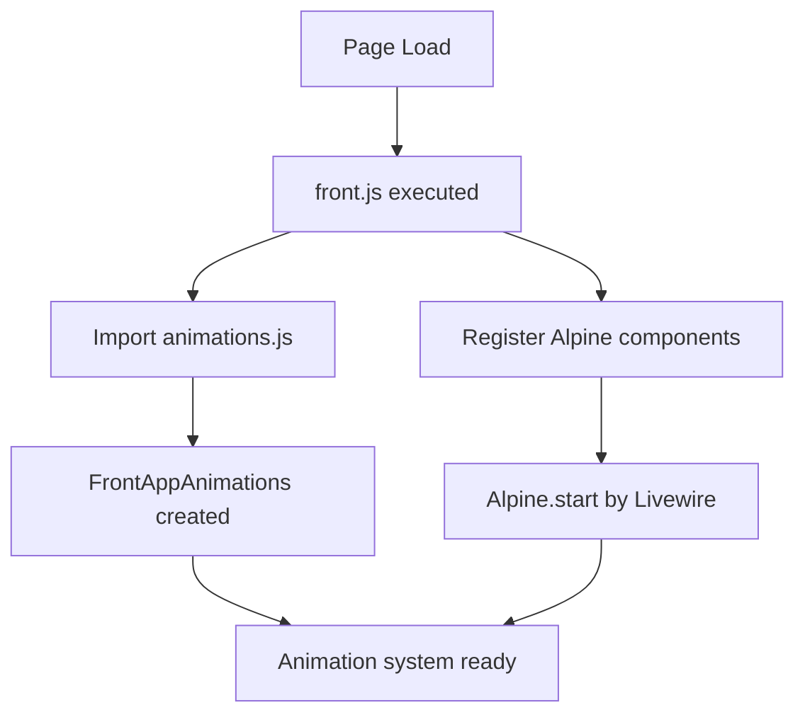
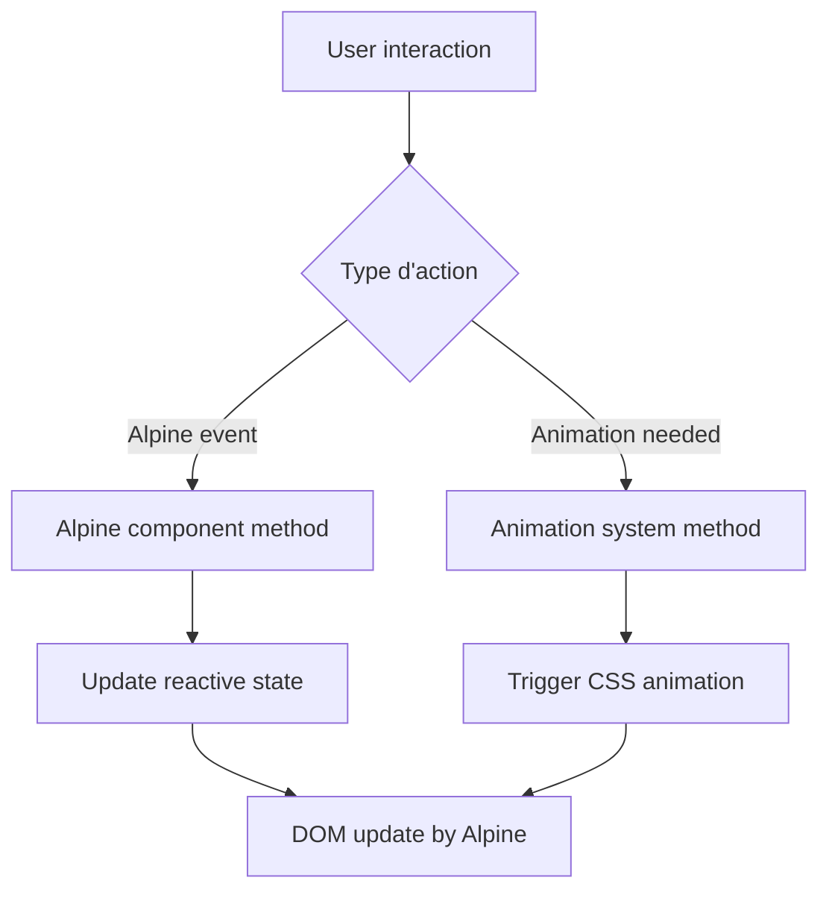

# Architecture JavaScript - Front App

## 🎯 Vue d'ensemble

Ce projet utilise une architecture JavaScript hybride ### **1. Initialisation**

```mermaid
graph TD
    A[Page Load] --> B[front.js executed]
    B --> C[Import animations.js]
    B --> D[Register Alpine components in alpine:init]
    C --> E[FrontAppAnimations created on DOMContentLoaded]
    D --> F[Alpine already started by Livewire]
    E --> G[Animation system ready]
    F --> G
```Alpine.js** (via Livewire) avec un système d'animation personnalisé inspiré d'ArtTherapy. L'approche privilégie la simplicité, la performance et la modularité.

## 📁 Structure des fichiers

```
resources/js/front/
├── front.js                    # Point d'entrée principal
├── components/
│   └── animations.js          # Système d'animation avancé
└── docs/
    ├── JAVASCRIPT_ARCHITECTURE.md
    └── ANIMATION_SYSTEM.md
```

## 🏗️ Architecture principale

### 1. **front.js - Point d'entrée**

Le fichier `front.js` est le cœur de l'application. Il utilise le **pattern Factory Function** pour créer des instances compatibles avec Alpine.js.

```javascript
window.frontApp = () => {
    return {
        // État réactif Alpine
        loading: false,
        notifications: [],
        
        // Méthodes d'instance
        init() { ... }
    }
}
```

#### **Pourquoi Factory Function ?**

- ✅ **Compatible Alpine.js** : Chaque composant a son propre état
- ✅ **Réactivité automatique** : Alpine gère les mises à jour
- ✅ **Isolation des données** : Pas de conflits entre composants
- ✅ **Instanciation multiple** : Réutilisable dans plusieurs endroits

### 2. **Composants Alpine intégrés**

Le système fournit des composants Alpine prêts à l'emploi :

```javascript
// Utilisation dans le HTML
<div x-data="frontApp()">
    <span x-text="loading ? 'Chargement...' : 'Prêt'"></span>
</div>

<div x-data="modal()">
    <button @click="open()">Ouvrir modal</button>
</div>

<div x-data="carousel(['item1', 'item2', 'item3'])">
    <button @click="next()">Suivant</button>
</div>
```

#### **Composants disponibles :**

| Composant | Description | Utilisation |
|-----------|-------------|-------------|
| `frontApp()` | App principale | État global, notifications, utilitaires |
| `modal()` | Système de modales | Ouverture/fermeture avec gestion du focus |
| `accordion()` | Accordéons | Toggle d'ouverture/fermeture |
| `tabs()` | Système d'onglets | Navigation entre sections |
| `carousel()` | Carrousel d'images | Navigation, auto-play |
| `tooltip()` | Info-bulles | Affichage contextuel |

### 3. **Système de notifications**

```javascript
// Dans un composant Alpine
<div x-data="frontApp()">
    <button @click="addNotification('Succès !', 'success', 3000)">
        Notifier
    </button>
    
    <!-- Affichage des notifications -->
    <div class="notifications">
        <template x-for="notification in notifications" :key="notification.id">
            <div :class="`notification ${notification.type}`" 
                 x-show="notification.show"
                 x-transition>
                <span x-text="notification.message"></span>
                <button @click="removeNotification(notification.id)">×</button>
            </div>
        </template>
    </div>
</div>
```

### 4. **Utilitaires globaux**

Le système fournit des utilitaires accessibles via `window.utils` :

```javascript
// Validation
utils.isValidEmail('test@example.com')      // true/false
utils.isValidPhoneFR('06 12 34 56 78')    // true/false

// Formatage
utils.formatPhoneFR('0612345678')          // "06 12 34 56 78"

// Performance
utils.debounce(func, 300)                  // Limitation d'appels
utils.throttle(func, 16)                   // Limitation de fréquence

// Divers
utils.generateId()                         // ID unique
```

## 🔄 Flux d'exécution

### 1. **Initialisation**



### 2. **Utilisation runtime**



## 🎨 Intégration avec le système d'animation

Le système d'animation fonctionne de manière autonome mais peut être contrôlé via `frontApp()` :

```javascript
// Dans un composant Alpine
<div x-data="frontApp()">
    <button @click="triggerAnimation('.my-elements', 'fade-in-up', 200)">
        Animer les éléments
    </button>
    
    <button @click="addCustomObserver(
        document.querySelectorAll('.special'),
        (entries) => { /* callback */ }
    )">
        Observer personnalisé
    </button>
</div>
```

## 🛠️ API de développement

### **frontApp() - Méthodes principales**

| Méthode | Paramètres | Description |
|---------|------------|-------------|
| `init()` | - | Initialisation automatique |
| `addNotification()` | message, type, duration | Ajouter une notification |
| `removeNotification()` | id | Supprimer une notification |
| `submitForm()` | formData, url, method | Soumission AJAX avec gestion d'erreurs |
| `scrollTo()` | elementId | Scroll fluide vers un élément |
| `copyToClipboard()` | text | Copier dans le presse-papier |
| `triggerAnimation()` | selector, type, delay | Déclencher animation manuelle |
| `addCustomObserver()` | elements, callback, options | Ajouter un observer personnalisé |

### **Événements lifecycle Alpine**

```javascript
// Dans un composant
<div x-data="frontApp()" 
     x-init="init()"           // Appelé à la création
     x-destroy="cleanup()">    // Appelé à la destruction
    
    <!-- Contenu du composant -->
</div>
```

## 🔧 Configuration et personnalisation

### **Variables d'environnement JavaScript**

Le système utilise des variables globales pour la configuration :

```javascript
// Accessibles partout
window.frontApp        // Factory function principale
window.frontAppAnimations  // Instance du système d'animation
window.utils          // Utilitaires globaux
```

### **Personnalisation des composants**

Vous pouvez étendre les composants existants dans `front.js` :

```javascript
// Dans la section document.addEventListener('alpine:init')
Alpine.data('customComponent', () => ({
    myState: 'initial',
    
    myMethod() {
        // Logique personnalisée
    }
}))
```

## 🚀 Bonnes pratiques

### **1. Gestion de l'état**
- ✅ Utilisez l'état local Alpine pour les données de composant
- ✅ Utilisez `frontApp()` pour l'état global et les utilitaires
- ❌ Évitez les variables globales non contrôlées

### **2. Performance**
- ✅ Utilisez `debounce/throttle` pour les événements fréquents
- ✅ Préférez les directives Alpine aux écouteurs manuels
- ✅ Nettoyez les observers lors de la destruction

### **3. Animations**
- ✅ Utilisez les classes CSS `.fade-in-*` pour les animations automatiques
- ✅ Utilisez `triggerAnimation()` pour les animations manuelles
- ❌ Évitez les animations JavaScript coûteuses

### **4. Debugging**
```javascript
// Accès aux instances pour debug
console.log(window.frontApp())           // Factory function
console.log(window.frontAppAnimations)   // Animation system
console.log(window.utils)                // Utilities

// Debug Alpine
Alpine.store('debug', true)  // En développement
```

## 📚 Ressources complémentaires

- [Alpine.js Documentation](https://alpinejs.dev/)
- [Animation System Documentation](./ANIMATION_SYSTEM.md)
- [Livewire Documentation](https://laravel-livewire.com/)
- [Intersection Observer API](https://developer.mozilla.org/en-US/docs/Web/API/Intersection_Observer_API)

---

*Cette documentation est maintenue avec le code. Pour toute modification de l'architecture, pensez à mettre à jour ce fichier.*

